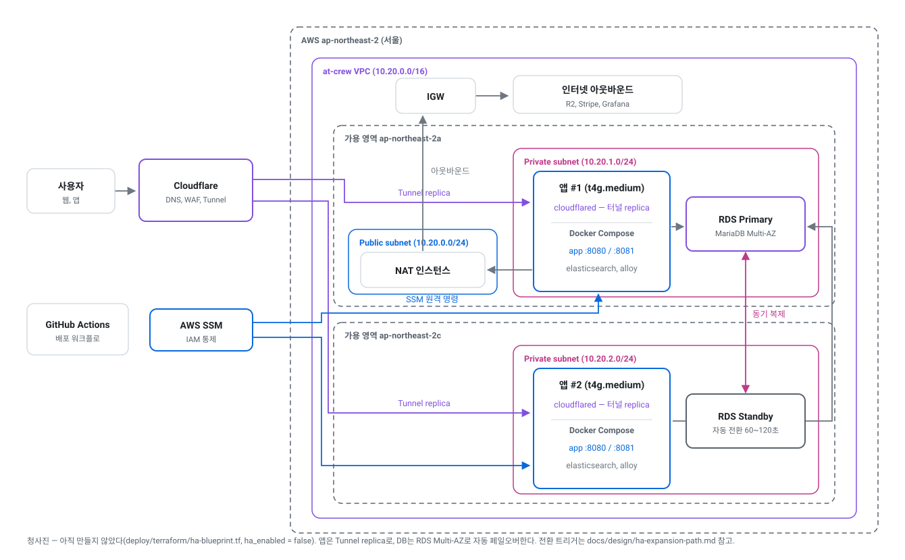

# AT-CREW Backend

       

창작자와 기업을 잇는 포트폴리오/구인 플랫폼 **AT-CREW**의 백엔드입니다.
운영 중이던 서비스 **라이트(Laiteu)** 의 기술 부채를 정리하기 위해 **모듈형 모놀리식(Modular Monolith)** 으로
전면 재작성했습니다. 

> **[API 문서](https://at-crew-api-docs.pages.dev/)** — REST Docs로 생성, main 병합 시 자동 갱신
> **서비스 API** — `https://api.at-crew.com`

## 기술 스택

| 영역 | 사용 기술 |
|---|---|
| 언어와 프레임워크 | Java 21, Spring Boot 4, Spring Modulith, Gradle |
| 데이터 | MariaDB(JPA/Hibernate), Flyway, Elasticsearch |
| 인증 | 자체 이메일 인증(JWT) + Firebase(Google 로그인) |
| 외부 연동 | Stripe(결제/구독), Cloudflare R2 + Worker(이미지 파이프라인), Resend(메일) |
| 테스트 | JUnit 5, Testcontainers, MockMvc + Spring REST Docs |
| 인프라 | Docker Compose on EC2(프라이빗 서브넷), nginx, Cloudflare Tunnel, AWS SSM, GitHub Actions |
| 관측 | Grafana Cloud(메트릭, 로그, 업타임), Sentry(에러), Discord 알람 |

## 시스템 아키텍처

이미지 파이프라인: ① 클라이언트는 서버가 발급한 presigned URL로 R2에 **직접** 올리고,
② 앱은 Worker를 비동기로 트리거만 하며, ③ 변환은 Worker가 R2를 상대로 수행하고, ④ 완료는
`X-Internal-Secret`으로 검증되는 webhook으로 되돌아옵니다.

### 인프라 구성

앱 서버는 프라이빗 서브넷에 있고, 외부 트래픽은
`cloudflared`가 바깥으로 연 Cloudflare Tunnel로만 들어옵니다. 배포와 운영 접속도 SSH가 아니라 AWS SSM을
거치므로, 열어야 할 포트도 CI에 둘 SSH 키도 없습니다. 아웃바운드만 NAT 인스턴스를 지나 나갑니다.

- **CI/CD** — PR마다 빌드와 전체 테스트, main 병합 시 arm64 이미지 빌드 → SSM으로 원격 재기동 → 헬스체크 → 실패 시 조건부 롤백
- **백업** — MariaDB 덤프를 매일 R2로 업로드, 26시간 이상 성공 기록이 없으면 P1 알람
- **복구** — 백업 복원과 인스턴스 재생성을 실제로 수행해 **RTO 약 5분**을 실측했습니다.

### 설계 기준

구성을 고른 근거를 숫자로 고정해 둡니다. 근거가 없으면 "일단 이중화"로 흐르고, 그 비용은 트래픽이
아니라 청구서에만 나타납니다.

| 항목 | 값 | 근거 |
|---|---|---|
| 목표 사용자 규모 | MAU 1,000 | 서비스 출시 첫 해 목표 |
| 설계 피크 | **약 5 RPS** | DAU 300(MAU의 30%) × 세션당 30요청 = 일 9,000요청, 피크 시간대에 20% 집중 시 약 0.5 RPS. 10배 여유를 둔 값 |
| 실측 한계 처리량 | **약 15 RPS** | `t4g.medium` 1대, 작품 10만 건. 같은 데이터에서 N+1을 고친 뒤 무릎이 약 27 RPS로 올라갔습니다 |
| RTO | **약 5분** | 인스턴스 재생성과 루트 볼륨 교체를 실제로 수행해 잰 값(2026-09-03 볼륨 교체 5분 1초) |
| RPO | **최대 24시간** | 일 1회 덤프. 2 AZ 전환 시 반동기 복제로 0에 가깝게 내려갑니다 |

설계 피크의 3배를 실측 한계가 덮습니다. **이중화를 켤 근거가 아직 숫자에 없습니다** — 그래서 켜지
않았고, 대신 켤 수 있는 상태로 만들어 뒀습니다.

### 2 AZ 이중화 확장 경로 (정의만 하고 꺼 둔 상태)

`deploy/terraform/ha-blueprint.tf`에 앱 2대 + RDS Multi-AZ 구성이 들어 있고 `ha_enabled = false`로
꺼져 있습니다. 전환 조건과 절차, 비용은 [ha-expansion-path](docs/design/ha-expansion-path.md)에
숫자로 적었습니다.

### 보안

| 계층 | 구성 |
|---|---|
| 인바운드 | 열린 포트 없음 — Cloudflare Tunnel의 아웃바운드 연결로만 트래픽이 들어옵니다 |
| WAF | Cloudflare 관리형 룰셋(엣지). 방화벽(보안 그룹)이 "누가 닿을 수 있나"를, WAF가 "무엇을 보내는가"를 봅니다 |
| 운영 접속 | SSH 없음 — AWS SSM Session Manager. CI에 둘 개인키도 없습니다 |
| 저장 데이터 | EBS 볼륨 전체 암호화(KMS), 계정 기본 암호화 활성 |
| 비밀 | 서버의 `.env`와 GitHub Actions 시크릿으로 분리, 커밋 전 gitleaks 훅이 검사 |
| 감사 | 요청 로그에 주체(`memberId`)와 요청 ID, 데이터 변경에 `last_modified_by`. 운영자의 DB 직접 조작도 같은 컬럼에 남깁니다 |

## 모듈 구조

도메인 모듈은 서로 직접 의존하지 않습니다. 공개 인터페이스(루트 패키지)와 도메인 이벤트로만 통신하고,
구현은 각 모듈의 `internal/` 아래에 감춥니다. `ModularStructureTests`가 Spring Modulith의 `modules.verify()`로 경계 위반과 순환 의존을 빌드에서 잡습니다.

## 문서

| 분류 | 위치 |
|---|---|
| 설계 문서 | [docs/design/](docs/design/) — 모듈별 설계와 의사결정 근거 |
| 운영 절차 | [docs/operations/](docs/operations/) — 장애 대응 런북, 모더레이션 |
| 운영 기준선 | [docs/operations/baseline/](docs/operations/baseline/) — 성능·복구 실측값과 재현 스크립트. 개선 전후를 같은 절차로 비교한다 |
| 규약 | [CONTRIBUTING.md](CONTRIBUTING.md), [docs/conventions/](docs/conventions/) |
| 테스트 전략 | [docs/testing/rest-docs-guide.md](docs/testing/rest-docs-guide.md) |
| 로드맵 | [docs/roadmap.md](docs/roadmap.md) |
| 다이어그램 생성 | [scripts/diagrams/build.py](scripts/diagrams/build.py) — 위 SVG 네 개를 다시 만든다 (`architecture` \| `infra` \| `infra-ha` \| `modules`) |

## 라이선스

[LICENSE](LICENSE) — 저작권자의 사전 허가 없이 복제, 수정, 배포, 상업적 이용을 할 수 없습니다.
저장소 공개는 열람과 참고를 위한 것입니다.
