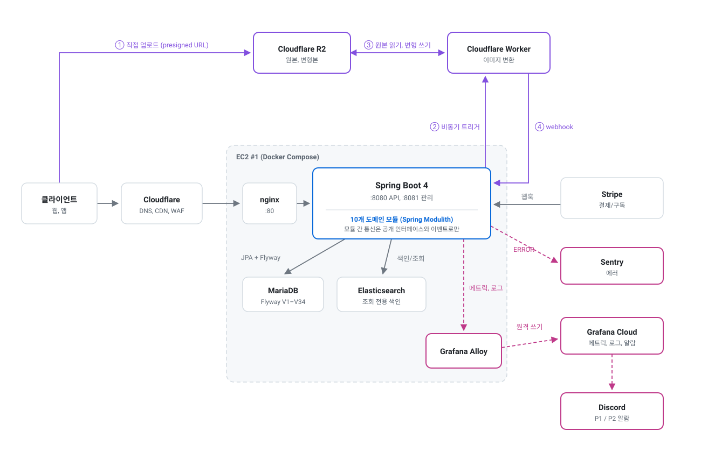
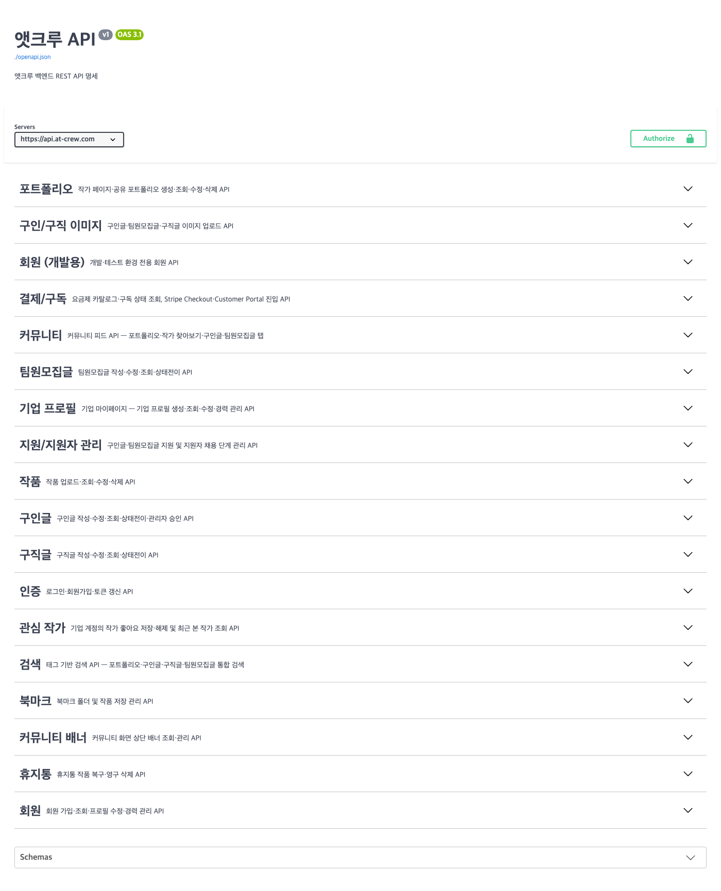

# AT-CREW Backend

[](https://github.com/pack-in/at-crew-backend/actions/workflows/deploy.yml) [](https://at-crew-api-docs.pages.dev/)      

창작자와 기업을 잇는 포트폴리오/구인 플랫폼 **AT-CREW**의 백엔드입니다.
운영 중이던 서비스 **라이트(Laiteu)** 의 기술 부채를 정리하기 위해 **모듈형 모놀리식(Modular Monolith)** 으로
전면 재작성했고, 라이트 종료 전 무중단 데이터 마이그레이션을 전제로 데이터 모델 호환성을 유지합니다.

> **[API 문서](https://at-crew-api-docs.pages.dev/)** — REST Docs로 생성, main 병합 시 자동 갱신
> **서비스 API** — `https://api.at-crew.com`

## 한눈에 보기

| 항목 | 규모 |
|---|---|
| 도메인 모듈 | 10개 + 공용 `common` |
| 프로덕션 코드 | Java 447개 파일, 23,276줄 |
| 테스트 코드 | Java 70개 파일, 15,274줄 (프로덕션 대비 66%) |
| DB 마이그레이션 | Flyway `V1` ~ `V34` |
| 공개 API | 97개 경로, 119개 오퍼레이션, 18개 태그 |
| 외부 연동 | Stripe, Cloudflare R2/Worker, Elasticsearch, Resend, Firebase |
| 운영 | EC2 자동 배포 + 헬스체크 조건부 롤백, Grafana Cloud, Sentry, Discord 2단계 알람, 일 1회 DB 백업 |

## 기술 스택

| 영역 | 사용 기술 |
|---|---|
| 언어와 프레임워크 | Java 21, Spring Boot 4, Spring Modulith, Gradle |
| 데이터 | MariaDB(JPA/Hibernate), Flyway, Elasticsearch |
| 인증 | 자체 이메일 인증(JWT) + Firebase(Google 로그인) |
| 외부 연동 | Stripe(결제/구독), Cloudflare R2 + Worker(이미지 파이프라인), Resend(메일) |
| 테스트 | JUnit 5, Testcontainers, MockMvc + Spring REST Docs |
| 인프라 | Docker Compose on EC2, nginx, Cloudflare, GitHub Actions |
| 관측 | Grafana Cloud(메트릭, 로그, 업타임), Sentry(에러), Discord 알람 |

## 시스템 아키텍처



이미지 파이프라인이 이 그림의 핵심입니다. ① 클라이언트는 서버가 발급한 presigned URL로 R2에 **직접** 올리고,
② 앱은 Worker를 비동기로 트리거만 하며, ③ 변환은 Worker가 R2를 상대로 수행하고, ④ 완료는
`X-Internal-Secret`으로 검증되는 webhook으로 되돌아옵니다 — **애플리케이션 서버는 이미지 바이트를 직접 다루지 않습니다.**

- **CI/CD** — PR마다 빌드와 전체 테스트, main 병합 시 arm64 이미지 빌드 → EC2 배포 → 헬스체크 → 실패 시 조건부 롤백
- **백업** — MariaDB 덤프를 매일 R2로 업로드, 26시간 이상 성공 기록이 없으면 P1 알람

## 모듈 구조

도메인 모듈은 서로 직접 의존하지 않습니다. 공개 인터페이스(루트 패키지)와 도메인 이벤트로만 통신하고,
구현은 각 모듈의 `internal/` 아래에 감춥니다. 이 규칙은 문서가 아니라 테스트로 강제됩니다 —
`ModularStructureTests`가 Spring Modulith의 `modules.verify()`로 경계 위반과 순환 의존을 빌드에서 잡습니다.



## 모듈

| 모듈 | 책임 | 설계 문서 |
|---|---|---|
| `auth` | 이메일 자체 인증, Google 로그인, JWT 발급/갱신, 비밀번호 재설정 | [auth-email-custom-redesign](docs/design/auth-email-custom-redesign.md) |
| `member` | 회원/작가 프로필, 거주 국가, 성인 콘텐츠 설정 | [global-country-plan](docs/design/global-country-plan-design.md) |
| `company` | 기업 계정, 프로필, 경력 | [company-profile-module](docs/design/company-profile-module-design.md) |
| `artwork` | 작품 CRUD, 북마크, 휴지통, 이미지 연결 | [artwork-module](docs/design/artwork-module-design.md) |
| `portfolio` | 작가 페이지, 공유 포트폴리오(고정형/최신반영형), 복제 | [portfolio-module](docs/design/portfolio-module-design.md) |
| `media` | Presigned URL 발급, Worker 트리거, 콜백, 재시도, 고아 파일 정리 | [media-module](docs/design/media-module-design.md) |
| `community` | 커뮤니티 피드, 배너, 작가 찾아보기 | [community-module](docs/design/community-module-design.md) |
| `search` | Elasticsearch 색인과 동기화, 다축 태그 필터 검색 | [search-module](docs/design/search-module-design.md) |
| `recruit` | 구인글, 팀원모집글, 구직글, 지원 접수, 끌어올리기, 관심 작가 | [recruit-module](docs/design/recruit-module-design.md) |
| `billing` | Stripe Checkout, 구독, 웹훅, entitlement 원장, 플랜 게이팅 | [billing-module](docs/design/billing-module-design.md) |

## 설계 결정

각 결정의 대안 검토 과정은 링크한 설계 문서에 남아 있습니다.

### 모듈 경계를 리뷰가 아니라 빌드가 막는다

모듈형 모놀리식은 규율이 없으면 6개월 만에 얽힌 단일체로 돌아갑니다. 그래서 경계 검증을 사람의 주의력에
맡기지 않고 `ApplicationModules.verify()`로 CI에 걸었습니다. 실제로 관측 코드를 `common`에 모으려다
순환 의존이 생겨 빌드가 깨졌고, 계측 위치를 각 소유 모듈로 되돌렸습니다.

### 이미지 파이프라인을 도메인에서 뽑아 `media` 모듈로

presign 발급, Worker 트리거, webhook 수신, 재시도, 고아파일 정리는 저장소/인프라 관심사이지 artwork의
도메인 규칙이 아닙니다. recruit이 같은 것을 두 번째로 필요로 한 시점에, 복제본이 세 번째로 늘기 전에
공용 모듈로 추출했습니다. [media-module §1](docs/design/media-module-design.md)

### MongoDB → MariaDB 전면 전환

문서형 저장소에서 관계형으로 옮기며 ID 전략, 스키마 정규화, 원자 연산 재설계, Modulith 이벤트
레지스트리까지 함께 정리했습니다. PK는 성능이 가장 좋은 `Long` 대신 String(UUIDv7)을 유지했습니다 —
연번 추측으로 인한 ID enumeration 노출과 4개 모듈의 공개 계약 전면 수정을 피하기 위해서입니다.
[mariadb-migration-design](docs/design/mariadb-migration-design.md)

### 검색은 별도 색인으로 분리

검색 화면이 7개 축의 다중선택 필터(담당 업무 22종, 장르 29종 등)와 한국어 관련도 검색을 동시에
요구해서, Elasticsearch를 **조회 전용** 색인으로 두고 원본은 MariaDB에 유지한 채 도메인 이벤트로
동기화합니다. [search-module](docs/design/search-module-design.md)

### 시간대는 UTC로 저장하고 표시에서만 변환

일본, 중국, 영미권 확장을 전제로 저장과 연산은 전부 `Instant`(UTC)이고, 변환은 표시 계층에서 회원
시간대 기준으로만 일어납니다. 컨테이너, JVM, 로그 타임스탬프까지 UTC로 못 박았습니다.
[global-timezone-strategy](docs/design/global-timezone-strategy.md)

### 사용자를 받기 전에 운영 가능한 상태로

실사용자 유입 전에 관측, 알람, 배포 안전장치, 백업을 먼저 갖췄습니다. 배포는 헬스체크 후 조건부 자동
롤백(스키마 변경이 낀 배포는 롤백하지 않고 사람을 호출), 알람은 P1/P2 2단계로 Discord에 라우팅합니다.
관측 스택은 자체 호스팅 대신 Grafana Cloud를 썼습니다 — 감시 대상과 함께 죽지 않아야 하고, 1인 운영에서
유지보수 대상을 늘리지 않기 위해서입니다.
[observability-design](docs/design/observability-design.md), [incident-runbook](docs/operations/incident-runbook.md)

## API 문서

MockMvc + REST Docs 테스트가 통과해야만 문서가 생성되고, main 병합마다 OpenAPI 3.1 스펙을 떠서
[Cloudflare Pages](https://at-crew-api-docs.pages.dev/)로 자동 배포합니다. 문서와 구현이 어긋날 수 없는 구조입니다.



prod에서는 springdoc이 꺼져 있어 실서버가 문서 소스가 될 수 없고, `OpenApiExportTest`가 유일한 생성 경로입니다.

## 로컬 실행

```bash
# 의존 서비스 기동 (MariaDB, Elasticsearch)
docker compose up -d

# 애플리케이션 실행 — http://localhost:8080, 관리 포트 8081
./gradlew bootRun

# 전체 테스트 (Testcontainers 사용, Docker 필요)
./gradlew build
```

Swagger UI는 로컬과 개발 프로필에서만 열립니다(`http://localhost:8080/swagger-ui.html`). prod에서는
꺼져 있고, 대신 정적으로 배포된 API 문서를 봅니다.

## 문서

| 분류 | 위치 |
|---|---|
| 설계 문서 | [docs/design/](docs/design/) — 모듈별 설계와 의사결정 근거 |
| 운영 절차 | [docs/operations/](docs/operations/) — 장애 대응 런북, 모더레이션 |
| 규약 | [CONTRIBUTING.md](CONTRIBUTING.md), [docs/conventions/](docs/conventions/) |
| 테스트 전략 | [docs/testing/rest-docs-guide.md](docs/testing/rest-docs-guide.md) |
| 로드맵 | [docs/roadmap.md](docs/roadmap.md) |
| 다이어그램 생성 | [scripts/diagrams/build.py](scripts/diagrams/build.py) — 위 SVG 두 개를 다시 만든다 |

전체 문서 인덱스는 [CLAUDE.md](CLAUDE.md)의 문서 목록 표에 있습니다.

## 라이선스

[LICENSE](LICENSE) — 저작권자의 사전 허가 없이 복제, 수정, 배포, 상업적 이용을 할 수 없습니다.
저장소 공개는 열람과 참고를 위한 것입니다.
