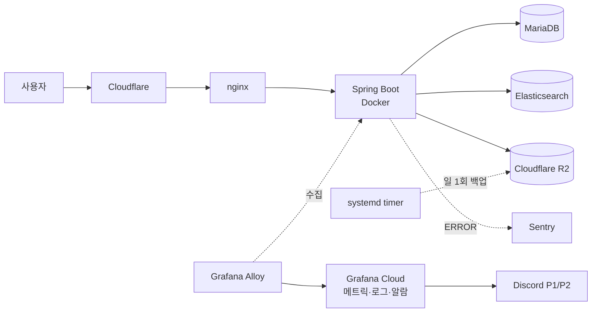

# AT-CREW Backend

창작자와 기업을 잇는 포트폴리오·구인 플랫폼 **AT-CREW**의 백엔드입니다.
기존 서비스 **라이트(Laiteu)** 의 기술 부채를 해소하기 위해 **모듈형 모놀리식(Modular Monolith)** 으로
전면 재작성했으며, 라이트 종료 전 무중단 데이터 마이그레이션을 전제로 데이터 모델 호환성을 유지합니다.

- **API 문서**: https://at-crew-api-docs.pages.dev/ (main 병합 시 자동 갱신)
- **서비스 API**: `https://api.at-crew.com`
- 규모: 프로덕션 코드 425개 · 테스트 64개 파일, Flyway 마이그레이션 24개, 도메인 모듈 10개

## 기술 스택

| 영역 | 사용 기술 |
|---|---|
| 언어·프레임워크 | Java 21, Spring Boot 4, Spring Modulith, Gradle |
| 데이터 | MariaDB(JPA/Hibernate), Flyway, Elasticsearch |
| 인증 | 자체 이메일 인증(JWT) + Firebase(Google 로그인) |
| 외부 연동 | Stripe(결제·구독), Cloudflare R2 + Worker(이미지 파이프라인), Resend(메일) |
| 테스트 | JUnit 5, Testcontainers, MockMvc + Spring REST Docs |
| 인프라 | Docker Compose on EC2, nginx, Cloudflare, GitHub Actions |
| 관측 | Grafana Cloud(메트릭·로그·업타임), Sentry(에러), Discord 알람 |

## 아키텍처

도메인 모듈은 서로 직접 의존하지 않습니다. 공개 인터페이스(루트 패키지)와 도메인 이벤트로만 통신하고,
구현은 각 모듈의 `internal/` 아래에 감춥니다. 이 규칙은 문서가 아니라 테스트로 강제됩니다 —
`ModularStructureTests`가 Spring Modulith의 `modules.verify()`로 경계 위반과 순환 의존을 빌드에서 잡습니다.

```mermaid
graph TD
  subgraph 사용자 접점
    auth[auth<br/>인증·토큰]
    member[member<br/>회원·작가 프로필]
    company[company<br/>기업 프로필]
  end
  subgraph 콘텐츠
    artwork[artwork<br/>작품·북마크·휴지통]
    portfolio[portfolio<br/>포트폴리오·공유링크]
    media[media<br/>이미지 업로드 파이프라인]
  end
  subgraph 탐색·거래
    community[community<br/>피드·배너]
    search[search<br/>Elasticsearch 검색]
    recruit[recruit<br/>구인·구직·모집·지원]
    billing[billing<br/>Stripe 결제·구독]
  end
  common[common<br/>보안·예외·응답·로깅·관측]

  artwork -->|이벤트| search
  artwork --> media
  recruit --> media
  recruit -->|이벤트| search
  portfolio --> artwork
  community --> artwork
  billing -->|권한 게이팅| recruit
  member --> common
```

## 모듈

| 모듈 | 책임 | 설계 문서 |
|---|---|---|
| `auth` | 이메일 자체 인증, Google 로그인, JWT 발급·갱신, 비밀번호 재설정 | [auth-email-custom-redesign](docs/design/auth-email-custom-redesign.md) |
| `member` | 회원·작가 프로필, 거주 국가, 성인 콘텐츠 설정 | [global-country-plan](docs/design/global-country-plan-design.md) |
| `company` | 기업 계정·프로필·경력 | [company-profile-module](docs/design/company-profile-module-design.md) |
| `artwork` | 작품 CRUD, 북마크, 휴지통, 이미지 연결 | [artwork-module](docs/design/artwork-module-design.md) |
| `portfolio` | 작가 페이지, 공유 포트폴리오(고정형·최신반영형), 복제 | [portfolio-module](docs/design/portfolio-module-design.md) |
| `media` | Presigned URL 발급, Worker 트리거, 콜백, 재시도, 고아 파일 정리 | [media-module](docs/design/media-module-design.md) |
| `community` | 커뮤니티 피드, 배너, 작가 찾아보기 | [community-module](docs/design/community-module-design.md) |
| `search` | Elasticsearch 색인·동기화, 다축 태그 필터 검색 | [search-module](docs/design/search-module-design.md) |
| `recruit` | 구인글·팀원모집글·구직글, 지원 접수, 끌어올리기, 관심 작가 | [recruit-module](docs/design/recruit-module-design.md) |
| `billing` | Stripe Checkout·구독·웹훅, entitlement 원장, 플랜 게이팅 | [billing-module](docs/design/billing-module-design.md) |

## 설계에서 특히 신경 쓴 것

**모듈 경계를 테스트로 강제** — 모듈형 모놀리식은 규율이 없으면 6개월 만에 얽힌 단일체로 돌아갑니다.
경계 위반을 리뷰가 아니라 빌드가 막습니다. 실제로 관측 코드를 `common`에 모으려다 순환 의존이 생겨
`modules.verify()`가 실패했고, 계측 위치를 각 소유 모듈로 되돌렸습니다.

**MongoDB → MariaDB 전면 전환** — 문서형 저장소에서 관계형으로 옮기며 ID 전략(UUIDv7), 스키마 정규화,
원자 연산 재설계, Modulith 이벤트 레지스트리까지 함께 정리했습니다.
[mariadb-migration-design](docs/design/mariadb-migration-design.md)

**시간대는 UTC로 저장하고 표시에서만 변환** — 일본·중국·영미권 확장을 전제로, 저장·연산은 `Instant`(UTC),
표시만 회원 시간대 기준입니다. 컨테이너·JVM·로그 타임스탬프까지 UTC로 못 박았습니다.
[global-timezone-strategy](docs/design/global-timezone-strategy.md)

**검색은 별도 색인으로 분리** — 7개 축의 다중선택 필터와 한국어 관련도 검색을 동시에 만족시켜야 해서
Elasticsearch를 조회 전용 색인으로 두고, 원본은 MariaDB에 유지한 채 도메인 이벤트로 동기화합니다.
[search-module](docs/design/search-module-design.md)

**운영 가능한 상태로 만들기** — 실사용자를 받기 전에 관측·알람·배포 안전장치·백업을 갖췄습니다.
배포는 헬스체크 후 조건부 자동 롤백(스키마 변경이 낀 배포는 롤백하지 않고 호출), 알람은 P1/P2 2단계로
Discord에 라우팅합니다. [observability-design](docs/design/observability-design.md) ·
[incident-runbook](docs/operations/incident-runbook.md)

## 운영 구성



- **CI/CD** — PR마다 빌드·전체 테스트, main 병합 시 arm64 이미지 빌드 → EC2 배포 → 헬스체크 → 실패 시 조건부 롤백
- **API 문서** — REST Docs로 생성한 OpenAPI를 Cloudflare Pages에 자동 배포
- **백업** — MariaDB 덤프를 매일 R2로 업로드, 26시간 이상 성공 기록이 없으면 P1 알람

## 로컬 실행

```bash
# 의존 서비스 기동 (MariaDB, Elasticsearch)
docker compose up -d

# 애플리케이션 실행 — http://localhost:8080, 관리 포트 8081
./gradlew bootRun

# 전체 테스트 (Testcontainers 사용, Docker 필요)
./gradlew build
```

Swagger UI는 로컬·개발 프로필에서만 열립니다(`http://localhost:8080/swagger-ui.html`). prod에서는
꺼져 있고, 대신 정적으로 배포된 API 문서를 봅니다.

## 문서

| 분류 | 위치 |
|---|---|
| 설계 문서 | [docs/design/](docs/design/) — 모듈별 설계와 의사결정 근거 |
| 운영 절차 | [docs/operations/](docs/operations/) — 장애 대응 런북, 모더레이션 |
| 규약 | [CONTRIBUTING.md](CONTRIBUTING.md), [docs/conventions/](docs/conventions/) |
| 테스트 전략 | [docs/testing/rest-docs-guide.md](docs/testing/rest-docs-guide.md) |
| 로드맵 | [docs/roadmap.md](docs/roadmap.md) |

전체 문서 인덱스는 [CLAUDE.md](CLAUDE.md)의 문서 목록 표에 있습니다.

## 라이선스

[LICENSE](LICENSE) — 저작권자의 사전 허가 없이 복제·수정·배포·상업적 이용을 할 수 없습니다.
저장소 공개는 열람과 참고를 위한 것입니다.
