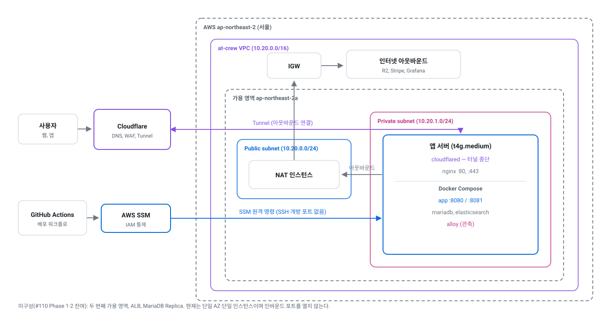

# AT-CREW Backend

       

창작자와 기업을 잇는 포트폴리오/구인 플랫폼 **AT-CREW**의 백엔드입니다.
운영 중이던 서비스 **라이트(Laiteu)** 의 기술 부채를 정리하기 위해 **모듈형 모놀리식(Modular Monolith)** 으로
전면 재작성했고, 라이트 종료 전 무중단 데이터 마이그레이션을 전제로 데이터 모델 호환성을 유지합니다.

> **[API 문서](https://at-crew-api-docs.pages.dev/)** — REST Docs로 생성, main 병합 시 자동 갱신
> **서비스 API** — `https://api.at-crew.com`

## 기술 스택

| 영역 | 사용 기술 |
|---|---|
| 언어와 프레임워크 | Java 21, Spring Boot 4, Spring Modulith, Gradle |
| 데이터 | MariaDB(JPA/Hibernate), Flyway, Elasticsearch |
| 인증 | 자체 이메일 인증(JWT) + Firebase(Google 로그인) |
| 외부 연동 | Stripe(결제/구독), Cloudflare R2 + Worker(이미지 파이프라인), Resend(메일) |
| 테스트 | JUnit 5, Testcontainers, MockMvc + Spring REST Docs |
| 인프라 | Docker Compose on EC2(프라이빗 서브넷), nginx, Cloudflare Tunnel, AWS SSM, GitHub Actions |
| 관측 | Grafana Cloud(메트릭, 로그, 업타임), Sentry(에러), Discord 알람 |

도메인 모듈 10개와 공용 `common`으로 나뉩니다. 프로덕션 Java 450개 파일 23,653줄에 테스트 72개 파일
15,919줄(프로덕션 대비 67%)이 붙어 있고, Flyway 마이그레이션은 `V35`까지, 공개 API는 97개 경로
119개 오퍼레이션입니다.

## 시스템 아키텍처

이미지 파이프라인이 이 그림의 핵심입니다. ① 클라이언트는 서버가 발급한 presigned URL로 R2에 **직접** 올리고,
② 앱은 Worker를 비동기로 트리거만 하며, ③ 변환은 Worker가 R2를 상대로 수행하고, ④ 완료는
`X-Internal-Secret`으로 검증되는 webhook으로 되돌아옵니다 — **애플리케이션 서버는 이미지 바이트를 직접 다루지 않습니다.**

### 인프라 구성

위 그림이 "요청이 어떤 컴포넌트를 지나는가"라면, 아래는 "그 컴포넌트가 어느 네트워크 경계 안에 있는가"입니다.

**인스턴스에 열린 인바운드 포트가 없습니다.** 앱 서버는 프라이빗 서브넷에 있고, 외부 트래픽은
`cloudflared`가 바깥으로 연 Cloudflare Tunnel로만 들어옵니다. 배포와 운영 접속도 SSH가 아니라 AWS SSM을
거치므로, 열어야 할 포트도 CI에 둘 SSH 키도 없습니다. 아웃바운드만 NAT 인스턴스를 지나 나갑니다.

2 AZ 이중화·ALB·DB Replica는 아직 구성하지 않았습니다(#110 Phase 1·2 잔여). 트래픽 규모가 이를 요구하는
시점에 올리는 편이 낫다고 봤고, 그때까지는 단일 AZ·단일 인스턴스라는 사실을 그림에 그대로 적어 둡니다.

- **CI/CD** — PR마다 빌드와 전체 테스트, main 병합 시 arm64 이미지 빌드 → SSM으로 원격 재기동 → 헬스체크 → 실패 시 조건부 롤백
- **백업** — MariaDB 덤프를 매일 R2로 업로드, 26시간 이상 성공 기록이 없으면 P1 알람

## 모듈 구조

도메인 모듈은 서로 직접 의존하지 않습니다. 공개 인터페이스(루트 패키지)와 도메인 이벤트로만 통신하고,
구현은 각 모듈의 `internal/` 아래에 감춥니다. 이 규칙은 문서가 아니라 테스트로 강제됩니다 —
`ModularStructureTests`가 Spring Modulith의 `modules.verify()`로 경계 위반과 순환 의존을 빌드에서 잡습니다.

## 모듈

| 모듈 | 책임 | 설계 문서 |
|---|---|---|
| `auth` | 이메일 자체 인증, Google 로그인, JWT 발급/갱신, 비밀번호 재설정 | [auth-email-custom-redesign](docs/design/auth-email-custom-redesign.md) |
| `member` | 회원/작가 프로필, 거주 국가, 성인 콘텐츠 설정 | [global-country-plan](docs/design/global-country-plan-design.md) |
| `company` | 기업 계정, 프로필, 경력 | [company-profile-module](docs/design/company-profile-module-design.md) |
| `artwork` | 작품 CRUD, 북마크, 휴지통, 이미지 연결 | [artwork-module](docs/design/artwork-module-design.md) |
| `portfolio` | 작가 페이지, 공유 포트폴리오(고정형/최신반영형), 복제 | [portfolio-module](docs/design/portfolio-module-design.md) |
| `media` | Presigned URL 발급, Worker 트리거, 콜백, 재시도, 고아 파일 정리 | [media-module](docs/design/media-module-design.md) |
| `community` | 커뮤니티 피드, 배너, 작가 찾아보기 | [community-module](docs/design/community-module-design.md) |
| `search` | Elasticsearch 색인과 동기화, 다축 태그 필터 검색 | [search-module](docs/design/search-module-design.md) |
| `recruit` | 구인글, 팀원모집글, 구직글, 지원 접수, 끌어올리기, 관심 작가 | [recruit-module](docs/design/recruit-module-design.md) |
| `billing` | Stripe Checkout, 구독, 웹훅, entitlement 원장, 플랜 게이팅 | [billing-module](docs/design/billing-module-design.md) |

## 설계 결정

되돌리기 어려운 선택만 추렸습니다. 각 항목은 **무엇을 내주고 무엇을 얻었는지**로 적었고, 대안 검토
과정과 기각 사유는 링크한 설계 문서에 남아 있습니다.

| 결정 | 트레이드오프 | 문서 |
|---|---|---|
| 모듈 경계를 리뷰가 아니라 빌드가 막는다 | 초기 마찰과 우회 불가를 감수하고, 6개월 뒤 얽힌 단일체로 돌아가는 것을 막았다. 실제로 관측 코드를 `common`에 모으려다 순환 의존으로 빌드가 깨져 계측을 각 소유 모듈로 되돌렸다 | `ApplicationModules.verify()` |
| 이미지 파이프라인을 `media` 모듈로 추출 | 모듈 하나를 더 얹는 대신, presign·Worker·webhook·재시도·고아 정리가 artwork와 recruit에 중복되는 것을 막았다. 두 번째 소비자가 생긴 시점에 뽑았다 | [media-module](docs/design/media-module-design.md) |
| MongoDB → MariaDB 전면 전환, PK는 String(UUIDv7) | `Long` PK의 성능과 저장 효율을 내주고, 연번 추측에 의한 ID enumeration 노출과 공개 계약 4개 모듈의 전면 수정을 피했다 | [mariadb-migration](docs/design/mariadb-migration-design.md) |
| 검색은 Elasticsearch 조회 전용 색인으로 분리 | 색인 동기화 복잡도와 메모리 1GB를 내주고, 7개 축 다중선택 필터(담당 업무 22종·장르 29종 등)와 한국어 관련도 검색을 얻었다. 원본은 MariaDB에 두고 도메인 이벤트로만 동기화한다 | [search-module](docs/design/search-module-design.md) |
| 저장·연산은 UTC, 변환은 표시 계층에서만 | 표시마다 변환 비용을 치르고, 일본·중국·영미권 확장 시점의 데이터 마이그레이션을 없앴다. 컨테이너·JVM·로그 타임스탬프까지 UTC로 고정했다 | [global-timezone](docs/design/global-timezone-strategy.md) |
| 관측 스택은 자체 호스팅 대신 Grafana Cloud | 월 고정비와 외부 의존을 지고, **감시 대상과 함께 죽지 않는 관측**을 얻었다. 인스턴스 이전 중 수집이 끊겼을 때 외부 프로브는 조용하고 메트릭 알람만 울려 "서비스는 살아 있고 수집만 죽었다"를 알람만으로 판정할 수 있었다 | [observability](docs/design/observability-design.md) |
| 인바운드 포트를 하나도 열지 않는다 | Cloudflare Tunnel과 AWS SSM에 의존하는 대신, origin IP 직접 타격 경로와 CI에 두는 SSH 키를 함께 없앴다. 보안 그룹을 배포마다 여닫던 절차도 사라졌다 | [incident-runbook](docs/operations/incident-runbook.md) |
| 사용자를 받기 전에 운영 가능한 상태로 | 기능 출시를 늦추고, 관측·알람·조건부 롤백·백업을 먼저 세웠다. 스키마 변경이 낀 배포는 자동 롤백하지 않고 사람을 부른다 — 스키마는 되돌아가지 않기 때문이다 | [observability](docs/design/observability-design.md) |

## API 문서

MockMvc + REST Docs 테스트가 통과해야만 문서가 생성되고, main 병합마다 OpenAPI 3.1 스펙을 떠서
[Cloudflare Pages](https://at-crew-api-docs.pages.dev/)로 자동 배포합니다. 문서와 구현이 어긋날 수 없는 구조입니다.

prod에서는 springdoc이 꺼져 있어 실서버가 문서 소스가 될 수 없고, `OpenApiExportTest`가 유일한 생성 경로입니다.

## 문서

| 분류 | 위치 |
|---|---|
| 설계 문서 | [docs/design/](docs/design/) — 모듈별 설계와 의사결정 근거 |
| 운영 절차 | [docs/operations/](docs/operations/) — 장애 대응 런북, 모더레이션 |
| 규약 | [CONTRIBUTING.md](CONTRIBUTING.md), [docs/conventions/](docs/conventions/) |
| 테스트 전략 | [docs/testing/rest-docs-guide.md](docs/testing/rest-docs-guide.md) |
| 로드맵 | [docs/roadmap.md](docs/roadmap.md) |
| 다이어그램 생성 | [scripts/diagrams/build.py](scripts/diagrams/build.py) — 위 SVG 세 개를 다시 만든다 (`architecture` \| `infra` \| `modules`) |

전체 문서 인덱스는 [CLAUDE.md](CLAUDE.md)의 문서 목록 표에 있습니다.

## 라이선스

[LICENSE](LICENSE) — 저작권자의 사전 허가 없이 복제, 수정, 배포, 상업적 이용을 할 수 없습니다.
저장소 공개는 열람과 참고를 위한 것입니다.
