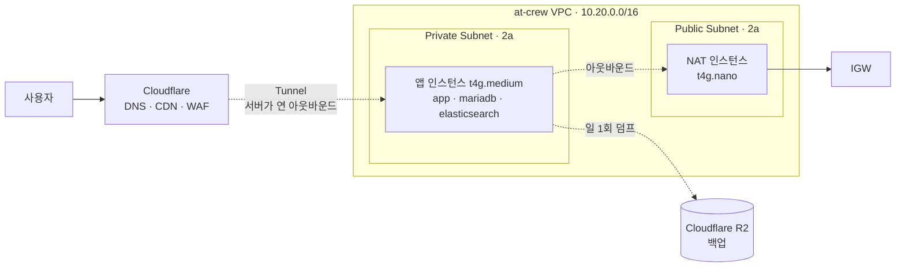
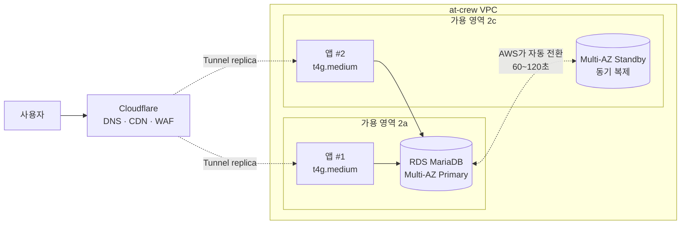

# 고가용성 확장 경로 — 지금은 켜지 않고, 켤 수 있게 만들어 둔다

> 작성일: 2026-09-03
> 상태: **청사진 확정, 미적용**(`deploy/terraform/ha-blueprint.tf`, `var.ha_enabled = false`)
> 근거 측정: `docs/operations/baseline/` (2026-09-02 부하, 2026-09-03 RTO)

## 1. 결정

**앱 2대 + RDS Multi-AZ 구성을 Terraform으로 정의해 두되, 지금은 만들지 않는다.**
사용자가 늘어 근거가 생기면 변수 하나(`ha_enabled = true`)로 켠다.

이유는 둘이다.

- **지금 켤 근거가 없다.** 실사용자 0명, 한계 처리량 약 15 RPS, RTO 실측 약 5분.
  자동 페일오버가 보호할 대상이 아직 없고 월 약 $70이 추가된다
- **필요해진 뒤에 설계하면 늦다.** 그때는 이미 사용자가 있다. 설계와 검증은 한가할 때 해 둔다

## 2. 현재 구성



**단일 AZ, 단일 인스턴스, 컨테이너 3개가 한 호스트를 공유한다.**

| 계층 | 장애 시 | 복구 |
|---|---|---|
| 앱 | 중단 | 컨테이너 `restart: always` 또는 재생성(RTO 약 5분) |
| DB | 중단 + 마지막 백업 이후 데이터 손실 | R2 덤프 복원(RPO 최대 24시간) |
| AZ 전체 | 중단 | 다른 AZ에 재생성(RTO 약 5분 + 판단 시간) |

## 3. 목표 구성 (`ha_enabled = true`)



**두 계층이 모두 자동으로 복구된다.**

| 계층 | 자동 페일오버 | 방식 |
|---|---|---|
| 앱 | ✅ | Cloudflare Tunnel replica — 죽은 커넥터로 트래픽이 가지 않는다 |
| DB | ✅ | RDS Multi-AZ — AWS가 standby로 60~120초에 전환. **엔드포인트는 하나** |

### 3.1. ALB를 쓰지 않는 이유

Cloudflare Tunnel은 같은 터널에 **cloudflared를 여러 대(최대 25 replica)** 붙일 수 있다.
한 호스트가 죽어도 나머지 커넥터로 트래픽이 간다. **ALB 없이 앱 계층 자동 페일오버가 된다.**

- 절감: 월 $20~38
- 대가: replica는 **트래픽 분산 알고리즘을 제공하지 않는다.** 지리적으로 가까운 replica로 보낼 뿐이다.
  능동적 헬스체크 기반 분산이 필요해지면 그때 Cloudflare Load Balancer를 검토한다

### 3.2. self-hosted Replica가 아니라 RDS인 이유

**자동 페일오버 하나 때문이다.** self-hosted는 사람이 승격 스크립트를 실행해야 한다
(설계 문서 D7이 자동화를 일부러 뺐다 — 소규모 팀의 자체 페일오버는 복제 지연을 장애로 오인해
split-brain을 만든다). RDS Multi-AZ는 그 판단을 AWS가 대신한다.

부수 효과로 **RPO가 24시간에서 5분(PITR)으로 줄어든다.**

| | self-hosted Replica | RDS Multi-AZ |
|---|---|---|
| 페일오버 | 수동 승격 | **자동 60~120초** |
| RPO | 24시간(일 1회 덤프) | **5분(PITR)** |
| 월 비용 | $15 | **$40** |
| 운영 부담 | 패치·모니터링·승격 직접 | 없음 |
| split-brain 위험 | 직접 감당 | AWS |

## 4. 비용

| 구성 | 월 | 자동 페일오버 |
|---|---|---|
| **현재** (앱 1 + DB 1) | **약 $40** | ❌ |
| + self-hosted Replica | +$15 | ❌ DB 수동 승격 |
| + 앱 2대 (Tunnel replica) | +$30 | ✅ 앱만 |
| **목표** (앱 2 + RDS Multi-AZ) | **+$70 (합 $110)** | ✅ **양쪽** |

두 번째 AZ의 Private Subnet은 **`ha_enabled`와 무관하게 미리 만든다.** 서브넷 자체는 무료이고,
RDS Multi-AZ가 서로 다른 AZ의 서브넷 2개를 요구하므로 전환 시점에 이것부터 만들 필요가 없어진다.

## 5. 전환 트리거

아래 중 **하나라도** 충족하면 `ha_enabled = true`를 검토한다.

| 트리거 | 근거 |
|---|---|
| **실사용자 트래픽이 한계 처리량의 30%(약 5 RPS)에 도달** | 2026-09-02 측정 기준. 여유가 3배 아래로 떨어지는 지점 |
| **중단 1분의 금전적 비용이 월 $70을 넘음** | 그 시점부터 이중화가 비용을 정당화한다 |
| **RPO 24시간이 사업상 허용되지 않게 됨** | 결제·정산 데이터가 쌓이면 하루치 손실은 감당하기 어렵다 |
| 운영자가 즉시 대응할 수 없는 시간대에 장애가 반복 | 수동 승격의 전제가 깨진 것 |

## 6. 전환 절차

```bash
cd deploy/terraform

# 1) 무엇이 생기는지 먼저 본다 — 실제로 만들지 않는다
terraform plan -var ha_enabled=true

# 2) 켠다
terraform apply -var ha_enabled=true
```

그 뒤 사람이 해야 하는 것.

- [ ] 앱 `.env`의 `MARIADB_HOST`를 RDS 엔드포인트로 변경
- [ ] **컨테이너 MariaDB에서 RDS로 데이터 이관** — 마지막 덤프를 RDS에 복원하고 정합성 대조
- [ ] `docker-compose.app.yml`에서 `mariadb` 서비스 제거(앱 인스턴스 메모리가 600m 비워진다)
- [ ] 두 번째 앱 인스턴스에 `cloudflared`를 같은 터널로 연결
- [ ] **두 인스턴스 모두에서 `./bootstrap.sh` 실행** — 관측·백업은 인스턴스마다 필요하다
- [ ] 페일오버 드릴 — RDS 콘솔에서 강제 전환을 걸고 앱이 자동 복구되는지 확인
- [ ] `docs/operations/incident-runbook.md`의 "DB Replica 승격" 절을 RDS 기준으로 갱신

**마지막 항목이 중요하다.** 자동 페일오버로 바뀌면 수동 승격 런북은 더 이상 맞지 않는다.

## 7. 이 결정이 틀릴 수 있는 지점

- **트래픽이 예고 없이 오면** 트리거를 확인하기 전에 장애를 겪을 수 있다.
  Grafana 업타임·요청량 알람이 그 방어선이다
- **RDS 11.4 지원 여부**는 전환 시점에 다시 확인해야 한다. AWS의 MariaDB 버전 지원은 시간이 지나면
  바뀐다. 지금 `var.rds_engine_version`에 박아 둔 값은 컨테이너 버전과 맞춘 것일 뿐이다
- **`terraform plan`을 아직 돌려 보지 못했다**(작성 환경에 Terraform CLI 없음). 문법과 참조
  무결성은 확인했으나 **첫 `plan`에서 오류가 날 수 있다.** 전환 전에 반드시 확인한다
