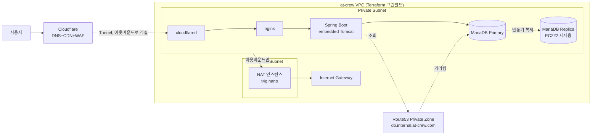

# 프로덕션 인프라 보안 강화 설계

> 작성일: 2026-09-01
> 상태: 설계 확정 (구현 착수 전)
> 범위: Cloudflare Full(strict) 전환, SSH→SSM, VPC Public/Private 분리, 자체 NAT 인스턴스,
> Cloudflare Tunnel 기반 인바운드 제거, MariaDB 반동기 Replica, Cloudflare WAF
> 관련 이슈: [#110](https://github.com/pack-in/at-crew-backend/issues/110)
> 계획 문서: `plans/260901-infra-upgrade/`(개인 문서, 커밋 안 함)

---

## 0. 배경 — 지금 상태와 참고 아키텍처의 격차

실사용 결제 트래픽(PRO_YEARLY)이 이미 발생하는 시점에 프로덕션 인프라를 점검했다.

| 항목 | 참고 아키텍처(3-Tier 표준) | 현재 앳크루 |
|---|---|---|
| 네트워크 | VPC Public/Private 서브넷 분리, Bastion | EC2 2대가 laiteu와 공유하는 기본 VPC, 서브넷 분리 없음, Bastion 없음(앱서버 경유 SSH) |
| 로드밸런서 | ALB | 없음 — EC2#1의 nginx가 직접 리버스 프록시 |
| DB | RDS Multi-AZ | 자체관리 MariaDB 단일 인스턴스, 복제 없음 |
| 배포 접근 | Bastion만 22 노출 | 배포마다 GitHub Actions 러너 IP로 22번 임시 개방 |
| 엣지 | WAF+CloudFront+Route53 | Cloudflare(SSL 모드 **Flexible** — Cloudflare~오리진 구간 평문 HTTP) |

`docs/NEXT_STEPS.md`에 이미 명시된 기존 방침도 이 설계의 전제다: **NAT Gateway 사용 금지(비용 폭탄 원인)**, MariaDB는 "포트폴리오 목적상 관리형 DB 운영 경험이 필요 없다고 판단해 비용 우선"으로 self-hosted 선택. 이번 설계는 이 우선순위를 뒤집지 않고, 그 안에서 보안 수준을 올린다.

## 1. 결정 요약

| # | 결정 | 근거 |
|---|---|---|
| D1 | 엣지는 Cloudflare 유지, CloudFront/AWS WAF/Route53 공개 존으로 전면교체하지 않는다 | 현재 트래픽 규모 대비 요청 기반 과금 증가가 이득보다 크다 |
| D2 | SSH 인바운드를 완전히 제거하고 SSM Session Manager로 전환한다 | `deploy.yml`에 이미 TODO로 명시돼 있던 항목, 배포마다 보안그룹을 여닫는 리스크 제거 |
| D3 | NAT Gateway 대신 자체 NAT 인스턴스(t4g.nano)를 쓴다 | `docs/NEXT_STEPS.md`의 기존 방침("NAT Gateway 금지")을 지키면서 Private Subnet의 아웃바운드 경로를 확보 |
| D4 | ALB 대신 Cloudflare Tunnel(cloudflared)로 인바운드 자체를 없앤다 | 앱 인스턴스가 아직 1대뿐이라 ALB 본연의 가치(다중 대상 분산)가 없다. 인바운드 포트를 아예 없애 SG 오설정 리스크도 함께 제거 |
| D5 | VPC는 Terraform으로 그린필드 신설, 기존 리소스는 import하지 않고 blue-green으로 이전한다 | 기존 EC2·SG는 콘솔에서 수동 생성돼 상태가 불명확 — import 시 상태 불일치 리스크가 크다 |
| D6 | DB는 RDS 대신 자체관리 MariaDB 반동기(semi-sync) Replica. **2026-09-02 정정**: 기존 EC2#2를 그 자리(기본 VPC)에서 재사용하지 않는다 — Primary가 D12로 새 VPC로 이전하면서, Replica도 결국 같은 새 VPC Private Subnet에 있어야 영구 Peering 없이 통신 가능하다. EC2#2는 이슈 #76(ES 통합) 완료 후 그냥 종료하고, Replica는 새 VPC에 신규 인스턴스로 만든다 | 추가 컴퓨팅 비용은 여전히 없음(EC2#2 종료로 절감된 예산 안에서 신규 인스턴스 1대), D12와 아키텍처 일관성 유지 |
| D7 | DB 승격(failover)은 자동화하지 않고 감지·알림만 자동화한다. 승격은 사람이 스크립트로 실행 | 소규모 팀이 자체 제작한 자동 페일오버는 replica lag를 장애로 오인해 split-brain을 일으키는 사고가 흔하다 |
| D8 | DB 엔드포인트는 Route53 Private Hosted Zone으로 추상화한다 | 승격 시 앱 재배포 없이 DNS 레코드 변경만으로 전환 |
| D9 | Cloudflare WAF 관리형 룰을 켠다(AWS WAF 대신) | 이미 쓰는 Cloudflare 위에 켜기만 하면 되고 Free 플랜으로 충분 |
| D10 | 보안그룹(인스턴스 단위)+NACL(서브넷 단위) 이중 방어를 건다 | 추가 비용 없이 방어 계층을 하나 더 얻는다 |
| D11 | RDS Multi-AZ 전환은 이번 범위에서 제외한다 | 월 $100~150+ 대비 현재 트래픽 규모에서 우선순위가 낮다. 결제 트래픽이 늘어나는 시점에 별도 이슈로 재평가 |
| D12 | **2026-09-02 추가**: blue-green 전환(PH-07) 시 MariaDB도 앱과 함께 새 VPC로 이전한다. 기존 EC2#1에 남겨두고 VPC Peering으로 연결하는 안은 채택하지 않는다 | 실제 apply 직후 발견 — 기존 `docker-compose.app.yml`의 MariaDB는 호스트에 포트를 노출하지 않아(같은 호스트의 app 컨테이너만 접근 가능) Peering을 뚫어도 네트워크 도달이 안 됨. 포트를 새로 노출하는 것은 지금까지의 "같은 호스트 안에서만 접근" 방어 원칙과 어긋나고, Peering이라는 영구 구조가 하나 더 생기며, 결국 나중에 한 번 더 옮겨야 하는 임시방편이다. DB까지 한 번에 옮기면 cutover 작업량은 늘지만 그 이후 상태가 더 단순하고 안전하다 |

### 1.1 채택하지 않은 안

- **CloudFront+AWS WAF+Route53 전면교체**: 참고 아키텍처와 완전히 동일해지지만 비용 대비 이득이 작다(D1).
- **관리형 NAT Gateway**: 팀 기존 방침 위반, 시간당+GB당 과금이 이번 업그레이드에서 가장 큰 고정비가 된다(D3).
- **ALB**: 인스턴스 1대뿐인 지금 트래픽 규모에서 정당화되지 않는다. 월 $20~38 추가(D4).
- **RDS Multi-AZ 즉시 전환**: 자동 페일오버는 매력적이나 월 $100~150+가 현재 규모 대비 과하다(D11).
- **MariaDB 완전 자동 페일오버(Orchestrator 등 검증 툴 없이 자체 구현)**: 소규모 팀이 split-brain 리스크를 직접 감당하기엔 위험하다(D7).
- **VPC Peering으로 기존 EC2#1의 DB를 그대로 두고 앱만 이전**: MariaDB 포트가 호스트에 노출돼 있지 않아 Peering만으로는 도달 불가 — 포트 노출까지 하면 임시방편에 영구 구조(Peering)를 더하는 꼴이라 채택하지 않았다(D12).

## 2. 목표 아키텍처

- Private Subnet에는 인바운드 라우팅 경로 자체가 없다 — cloudflared가 아웃바운드로 연 터널을 통해서만 트래픽이 들어온다.
- Public Subnet에는 NAT 인스턴스만 있다. 여기에도 SSH 인바운드는 없다(SSM으로 관리).
- WAS 계층은 별도 Tomcat이 아니라 Spring Boot 내장 Tomcat이 맡는다 — nginx(웹)-내장 Tomcat(WAS) 2계층은 이미 사실상 충족돼 있어 별도 구축이 필요 없다.

## 3. 비용 추정

기존 EC2 2대·EBS·Elastic IP 유지비는 변동 없음을 전제로, **새로 추가되는 항목만** 정리했다. 서울 리전 정확 단가는 AWS Pricing Calculator로 재확인이 필요하다(레포가 공개 저장소라 실제 인스턴스 타입을 기록하지 않아 이번 조사로 확정하지 못함).

| 항목 | 월 비용(추정) | 비고 |
|---|---|---|
| NAT 인스턴스(t4g.nano) | 약 $3~5 | 컴퓨팅+EBS 소액 |
| Route53 Private Hosted Zone | 약 $0.5 | 존 요금 $0.5 + 쿼리 소액 |
| Cloudflare WAF(관리형 룰) | $0 | Free 플랜 기본 제공 |
| Cloudflare Tunnel | $0 | 사용자 인증 게이팅 없이 순수 프록시 용도라 Zero Trust 좌석 과금 대상 아님 |
| ALB(미사용) | $0 | 관리형 NAT Gateway+ALB 조합(월 $60~100+) 대비 절감 |
| DB Replica 컴퓨팅 | $0 | 이슈 #76으로 비는 EC2#2 재사용, 신규 인스턴스 없음 |
| **월 순증 합계** | **약 $4~6** | |

## 4. 단계별 로드맵

- **Phase 0**: Cloudflare SSL Full(strict) 전환, SSH → SSM 전환
- **Phase 1**: Terraform VPC(단일 AZ로 시작)+NAT 인스턴스+SG/NACL, cloudflared 도입, 앱 서버 Private Subnet blue-green 이전, Cloudflare WAF 활성화
- **Phase 2**: MariaDB 반동기 Replica(EC2#2 재사용), 복제 지연 알람, Route53 Private Zone, 승격 런북 작성 및 드릴
- **Phase 3(향후, 별도 이슈)**: 결제 트래픽 규모가 커지는 시점에 RDS Multi-AZ 재검토, 앱 인스턴스가 2대 이상으로 늘어나면 nginx upstream 기반 L7 로드밸런싱 추가(이번 범위에서는 미구현 — 필요해지는 시점에 설정 추가만으로 가능)

상세 task 분해는 `plans/260901-infra-upgrade/PLAN-AGENT.md`(에이전트가 할 작업)·`PLAN-HUMAN.md`(AWS/Cloudflare 콘솔 작업, 승인, cutover 시점 결정)를 참고.

## 5. 리스크

| 리스크 | 완화 |
|---|---|
| cloudflared 데몬 다운 시 전체 서비스 다운(신규 단일장애점) | systemd `Restart=always`, Grafana Alloy로 프로세스/응답 감시 |
| NAT 인스턴스 다운 시 Private Subnet 아웃바운드 전면 차단 | 초기엔 단일 인스턴스로 시작, 필요 시 이중화는 향후 과제 |
| 수동 DB 승격 시 사람 대응 지연 | 런북을 사전에 스크립트화하고 실제 드릴(PH-09)로 RTO 실측 |
| Terraform 그린필드와 기존 수동 리소스 간 정합성 | 기존 리소스는 건드리지 않고 신규 VPC로 완전히 분리 구성, blue-green 전환 후에만 구 리소스 정리 |
