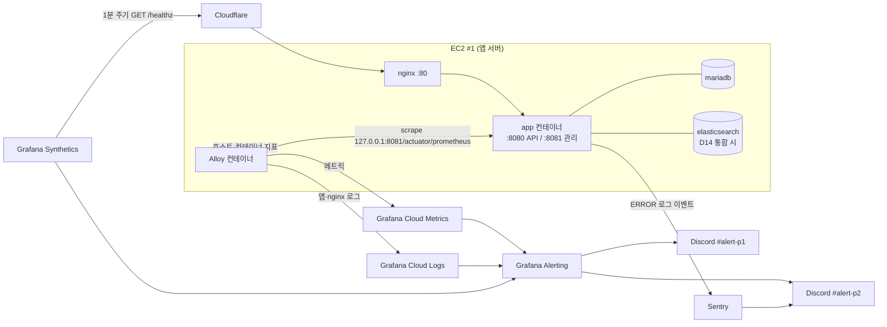

# 관측·알람(Observability) 설계

> 작성일: 2026-08-23
> 상태: 설계 확정 (구현 착수 전)
> 범위: prod 운영 감시 — 가용성·에러·성능·리소스·비즈니스 지표 수집, Discord 알람, 중앙 로그,
> 배포 안전장치(헬스체크·조건부 자동 롤백), MariaDB 백업과 백업 실패 감지
> 계획 문서: `plans/260823-observability/`(개인 문서, 커밋 안 함)

---

## 0. 배경 — 지금 상태

실사용자를 받기 직전 시점에 관측 자산이 사실상 없다.

| 항목 | 현재 |
|---|---|
| 메트릭 | Micrometer 레지스트리 없음. 커스텀 계측 0건 |
| actuator | `health`, `info`만 노출, `show-details: never`, 둘 다 `permitAll`(`SecurityConfig.java:100`) |
| 로그 | 콘솔 텍스트(UTC), MDC `requestId`/`memberId`, prod `root=WARN`·`com.atcrew=INFO`. **docker `json-file` 로테이션 없음** |
| 에러 추적 | 없음 — 5xx는 `log.error`로 남지만 아무도 보지 않는다 |
| 업타임 감시 | 없음. 장애를 사용자 제보로 인지 |
| 배포 검증 | `deploy.yml`이 `docker-compose up -d`까지만 수행. 기동 성공 여부 미확인 (2026-08-19 Flyway 순서 꼬임으로 크래시 루프 발생 이력) |
| DB 백업 | **없음.** 사용자 데이터는 EC2 #1의 도커 볼륨 하나에만 존재 |

## 1. 결정 요약

| # | 결정 | 근거 |
|---|---|---|
| D1 | 감시 범위는 가용성·에러·성능·리소스·비즈니스 지표 전부 | 런치 필수 |
| D2 | SaaS 무료 티어 조합, 자체 호스팅 안 함 | 1인 운영에서 감시 대상과 감시 도구를 같은 서버에 두면 함께 죽는다 |
| D3 | Grafana Cloud Free(메트릭·로그·알람·합성 감시) + Sentry Developer(에러) | 로그 기반 에러 알람은 지문 그룹핑·중복 억제가 없어 알람 폭주를 만든다 |
| D4 | 역할 분리: 예외는 Sentry만, 인프라·업타임 알람은 Grafana만, Loki 로그는 조사용(알람 소스 아님) | 같은 사건이 두 경로로 두 번 오는 것을 막는다 |
| D5 | PII는 마스킹 전제 반출 허용. 식별자는 `memberId`(UUID)까지 | 이메일·전화·토큰·비밀번호는 전송 전 제거 |
| D6 | 알람 채널은 Discord 웹훅 2개, 심각도 P1/P2 2단계 | 1인 운영에서 3단계 이상은 관리되지 않는다 |
| D7 | 관리 포트 8081 분리, 호스트 `127.0.0.1`에만 바인딩 | 경로 화이트리스트 실수로 메트릭이 외부 노출되는 경로를 원천 차단 |
| D8 | liveness(프로세스+DB)와 의존성 상세(ES·디스크·R2)를 분리 | ES 장애가 "API 전면 다운" P1으로 오인되지 않게 |
| D9 | Spring Boot 4 내장 구조화 로깅(prod만 JSON) | 의존성 추가 없이 MDC가 필드가 된다 |
| D10 | 비즈니스 지표는 **각 소유 모듈 안의** 이벤트 리스너에서 계측하고, 의존이 없는 것(미완료 이벤트 gauge)만 `common/observability`에 둔다 | 계측을 `common`에 모으면 `common`이 media·billing을 참조하게 되는데 두 모듈은 이미 `common`에 의존해 **모듈 순환**이 생긴다(`ModularStructureTests.modules.verify()` 실패). 2026-08-26 구현 중 발견해 수정 |
| D11 | 알람 임계값은 절대 건수 + 지속 시간 기준 | 트래픽 0에 가까운 초기에 비율 기준은 오탐 |
| D12 | DB 백업(일 1회 dump→R2)과 백업 실패 알람을 이번 범위에 포함 | 감지보다 데이터 소실 방지가 우선 |
| D13 | 배포 실패 시 자동 롤백, 단 새 Flyway 마이그레이션이 포함된 배포는 롤백하지 않고 P1 알람만 | 스키마는 되돌아가지 않아 구버전 앱이 `validate`에서 다시 죽는다 |
| D14 | Elasticsearch는 유지하되 EC2 #1로 통합하고 #2 종료(메모리 여유 확인 조건부) | 부담의 원인은 ES가 아니라 인스턴스 대수. 완성된 검색 모듈(27파일·1,646줄)을 되돌릴 이유가 없다 |

### 1.1 채택하지 않은 안

- **자체 호스팅 Prometheus+Grafana** — 관측 스택이 감시 대상과 함께 죽는다. 1인 운영에서 유지보수 대상이 하나 더 느는 비용이 SaaS 한도 제약보다 크다.
- **검색을 MariaDB로 되돌리고 ES 폐기** — 모니터링에서 줄어드는 건 알람 1~2개와 스크레이프 대상 1개뿐인데, 7축 다중선택 필터 + 한국어 관련도 검색을 SQL로 재작성해야 한다. MariaDB에 CJK용 `ngram` 파서가 있는지도 확인되지 않았다(MySQL 전용 기능).
- **Meilisearch 등 경량 엔진 교체** — 재작성 비용은 위와 같은데 검색 서버는 여전히 남아, EC2 통합안보다 나은 점이 없다.

## 2. 수집 아키텍처



Alloy는 EC2 #1에 **도커 컨테이너로** 올린다(호스트 systemd 아님) — 배포·재기동 방식을 기존 compose와 일관되게 유지한다.

## 3. 메트릭

### 3.1 노출 경로

- `micrometer-registry-prometheus` 의존성 추가, `/actuator/prometheus` 활성화.
- `management.server.port: 8081`로 관리 포트 분리. 컨테이너 포트는 `127.0.0.1:8081`에만 바인딩한다(앱 포트와 동일 원칙).
- 관리 포트를 분리하면 **8080에서 actuator가 사라진다.** 따라서 `SecurityConfig`의 `/actuator/health`·`/actuator/info` permitAll 규칙은 제거하고, 관리 엔드포인트용 `SecurityFilterChain`을 `@Order(0)`, `EndpointRequest.toAnyEndpoint()`, `permitAll`로 별도 선언한다(외부 접근은 네트워크 바인딩으로 이미 차단됨).
- 외부 업타임 프로브용 공개 경로는 nginx가 대신 만든다 — `location /healthz` → `proxy_pass http://127.0.0.1:8081/actuator/health/liveness`, 응답에 `Cache-Control: no-store`.
- 실측(2026-08-23 로컬 검증): 포트 분리 후 8080의 `/actuator/**`는 404가 아니라 **401**이다. 핸들러가
  없어 404가 되기 전에 메인 체인의 `anyRequest().authenticated()`가 먼저 거부하기 때문이다. 노출되지
  않는다는 결과는 같다.

### 3.2 수집 대상

| 그룹 | 출처 |
|---|---|
| HTTP | `http.server.requests`(엔드포인트별 요청 수·상태·p95) |
| JVM | 힙·GC·스레드 |
| DB | HikariCP 커넥션 풀, Flyway 상태 |
| 호스트 | CPU·메모리·디스크·파일디스크립터 (Alloy `node_exporter` 컴포넌트) |
| 컨테이너 | 재시작 횟수·상태 (Alloy `cadvisor`/docker 디스커버리) |
| Elasticsearch | 클러스터 상태·힙 (통합 시 컨테이너 지표 + ES HTTP 지표) |
| 비즈니스 | §6 커스텀 지표 |

### 3.3 헬스 인디케이터 분리 (D8)

```yaml
management:
  endpoint:
    health:
      group:
        liveness:
          include: ping, db          # 여기가 DOWN이면 진짜 서비스 불가 → P1
        readiness:
          include: db, elasticsearch, diskSpace   # 개별 항목은 P2
          show-details: always       # 관리 포트에서만 보이므로 상세 노출
      show-details: never            # /healthz로 외부에 나가는 liveness 응답은 상태만
```

R2는 헬스 인디케이터가 없다(자체 구현 대상 아님) — §6의 이미지 처리 실패 카운터로 감시한다.

## 4. 로그

- prod 프로필에서만 구조화 로깅 활성화(`logging.structured.format.console`). 로컬은 현행 사람이 읽는 포맷 유지. MDC의 `requestId`/`memberId`가 필드로 나간다.
- docker 로그 드라이버에 `max-size: 50m`, `max-file: 3` 지정 — 지금은 무제한이라 로그만으로 디스크가 찬다.
- Alloy가 수집: **앱 컨테이너 + nginx 액세스 로그**. MariaDB 로그는 제외(필요해지면 슬로우 쿼리 로그만 추가).
- nginx 액세스 로그에서 `/healthz`는 제외한다 — 1분 주기 200 로그가 Loki 무료 한도(50GB/월)의 상당 부분을 차지한다.
- 보관 14일(무료 티어). 조사 진입점은 `requestId`(실측 확인: ECS 포맷에서 MDC가 최상위 필드로 나간다).
- **주의(실측에서 발견)**: `GlobalExceptionHandler`가 인증/인가 실패를 `log.warn(..., e)`로 남겨
  스택트레이스 전문(약 10KB)이 로그에 포함된다. 크리덴셜 스터핑 같은 반복 실패 트래픽이 오면 Loki
  50GB 한도를 빠르게 소모한다. 인증/인가 실패는 스택트레이스 없이 남기도록 조정한다(PA-07).

## 5. 에러 추적 (Sentry)

- `sentry-spring-boot-starter` + **Logback 어펜더로 `ERROR`만 이슈화**. `GlobalExceptionHandler`가 이미 5xx=`error`, 인증/인가 실패=`warn`, 4xx=`debug`로 분류하고 있어 그 분류를 그대로 재사용한다.
- `warn`(인증/인가 실패)은 Sentry로 보내지 않는다 — 공격 트래픽만으로 무료 한도 5,000건/월이 소진된다. 해당 이벤트는 Loki에만 남기고 필요 시 Grafana에서 본다.
- 트레이싱 비활성(`tracesSampleRate: 0`).
- PII: `sendDefaultPii: false`, `beforeSend`에서 이메일·토큰·비밀번호 패턴 제거(`common/logging/LogMask` 정책 재사용). 태그는 `requestId`·`memberId`·에러코드만.
- `SENTRY_DSN`은 prod 필수값 fail-fast 목록에 넣는다 — 관측 도구가 조용히 꺼져 있는 상태를 만들지 않는다.

## 6. 비즈니스 지표 (D10)

먼저 **이미 수집되는 HTTP 지표로 표현되는 것은 커스텀 지표를 만들지 않는다.** 가입 성공·실패, 로그인
실패는 `http_server_requests_seconds_count`의 `uri`+`status` 조합으로 그대로 나온다(2026-08-26
구현 중 정리 — 초안의 7개 카운터 중 3개가 여기에 해당했다).

새로 만드는 것은 HTTP 지표로 드러나지 않는 것뿐이다.

| 지표 | 타입 | 위치 | 왜 필요한가 |
|---|---|---|---|
| `atcrew_billing_checkout_completed_total{product}` | counter | `billing` — `BillingMetrics` | 웹훅 엔드포인트가 하나라 HTTP 지표로는 결제 성사 여부를 알 수 없다 |
| `atcrew_billing_subscription_payment_failed_total{plan}` | counter | `billing` — `SubscriptionPaymentFailedEvent` 리스너 | 정기 결제 실패는 서버 오류가 아니라 이벤트다 |
| `atcrew_media_processing_total{status,owner_type}` | counter | `media` — `MediaAssetProcessedEvent` 리스너 | 콜백은 실패 상태여도 HTTP 204라 성공과 구분되지 않는다 |
| `atcrew_mail_send_failure_total{provider}` | counter | `common/mail` — `ResendMailAdapter` | 발송 실패를 예외로 올리지 않고 삼키므로 로그 외 흔적이 없다 |
| `atcrew_media_pending_assets` | gauge | `media` — `MediaPendingMetrics` | 콜백이 **실패로 오는 것**이 아니라 **아예 오지 않는** 경우는 카운터가 움직이지 않는다. 잔량으로만 드러난다(이슈 #59) |
| `atcrew_modulith_incomplete_events` | gauge | `common/observability` | 이벤트 소비가 막히면 색인·후처리가 조용히 멈춘다. 스크레이프마다 조회하지 않고 60초 주기로 갱신한 값을 읽는다 |

`atcrew_media_processing_total`과 `atcrew_media_pending_assets`는 서로 다른 고장을 본다 — 앞은 "실패로
돌아온 콜백", 뒤는 "돌아오지 않는 콜백"이다. 2026-08-18~08-27에 Worker의 `SERVER_CALLBACK_URL`이 임시
터널을 가리켜 콜백이 한 건도 도착하지 않았는데 아무 알람도 울리지 않았던 것이 뒤쪽 공백이었다.

Stripe 웹훅 **처리 실패**는 따로 세지 않는다 — 서명 검증 실패는 4xx, 처리 중 예외는 5xx로 컨트롤러에서
그대로 나가므로 해당 URI의 HTTP 지표에 이미 잡힌다.

라벨에 이메일·핸들 등 식별 가능 값이나 고카디널리티 값(`memberId` 포함)을 넣지 않는다.

## 7. 알람

### 7.1 심각도

- **P1 (즉시 호출)** — Discord `#alert-p1`. 새벽에도 깨우는 알림.
- **P2 (업무시간 확인)** — Discord `#alert-p2`. 조용히 쌓인다.

### 7.2 룰 (초안 — 2주 관찰 후 1회 조정 전제)

| 등급 | 조건 |
|---|---|
| P1 | 외부 프로브(`/healthz`) 2회 연속 실패 (약 2분) |
| P1 | 앱 컨테이너 재시작 3회 / 10분 |
| P1 | 디스크 사용률 85% 초과 |
| P1 | liveness DOWN 5분 지속 |
| P1 | 24시간 내 백업 성공 기록 없음 |
| P1 | 배포 헬스체크 실패 (마이그레이션 포함 배포라 자동 롤백을 하지 않은 경우) |
| P2 | 5xx 5건 / 5분 |
| P2 | 외부 의존성(Stripe·Resend·R2·ES) 실패 3건 / 10분 |
| P2 | p95 레이턴시 2초가 10분 지속 |
| P2 | 업로드 후 15분 초과 PENDING 이미지가 10분 지속 (콜백 미도착) |
| P2 | `atcrew_modulith_incomplete_events` 50 초과 |
| P2 | readiness 개별 항목 DOWN |

### 7.3 소음 억제

- 동일 알람 재알림 간격: P1 30분, P2 4시간.
- 같은 인스턴스의 알람은 하나의 Discord 메시지로 그룹핑.
- **배포 중 억제** — CI가 배포 시작 시 Grafana에 10분 silence를 생성하고 종료 시 해제한다. 배포로 인한 짧은 재시작이 매번 P1을 울리면 두 주 안에 알람을 무시하게 된다.
- 배포 헬스체크 실패·롤백 통지는 silence와 무관한 별도 경로(CI가 Discord 웹훅 직접 호출)라 항상 도착한다.
- **복구 알림(resolved)도 같은 채널로 보낸다** — 알람만 오고 끝났는지 모르는 상태를 없앤다.

## 8. 대시보드

정의는 클릭으로 만들지 않고 JSON으로 `deploy/observability/dashboards/`에 커밋한다.

1. **서비스 개요** — liveness 상태, 요청량·5xx·p95, 외부 의존성 실패, 컨테이너 재시작, 최근 배포 시각, 하단에 비즈니스 지표(가입·결제).
2. **인프라** — EC2 CPU·메모리·디스크, HikariCP 풀, ES 클러스터 상태, 미완료 이벤트 수, 백업 최종 성공 시각.

비즈니스 지표를 별도 대시보드로 빼지 않는 이유: 장애 판단 시 "가입이 멈췄는가"를 같은 화면에서 봐야 의미가 있다.

## 9. 배포 안전장치

`.github/workflows/deploy.yml` 확장:

1. 배포 시작 → Grafana silence(10분) 생성.
2. 컨테이너 재기동 후 **헬스체크 폴링** — `/actuator/health/liveness`가 UP이 될 때까지 최대 3분 대기.
3. 실패 시 분기 (D13):
   - 이번 배포에 `src/main/resources/db/migration/` 신규 파일이 **없으면** → 직전 성공 SHA 이미지로 자동 롤백 후 재검증.
   - **있으면** → 롤백하지 않고 P1 알람. 스키마가 전진한 뒤 구버전 앱은 `ddl-auto: validate`에서 다시 죽는다.
4. 성공·실패·롤백 **세 경우 모두** Discord 통지.
5. silence 해제(`if: always()`).

## 10. 백업

- EC2 #1에서 일 1회(cron) `mariadb-dump` → gzip → R2 업로드(기존 R2 자격증명 재사용). 보관 30일, 그 이상은 삭제.
- 성공 시 타임스탬프를 Alloy의 textfile 컬렉터가 읽는 파일에 기록 → `atcrew_backup_last_success_timestamp` 메트릭.
- 26시간 이상 갱신이 없으면 P1.
- 복구 절차는 런북에 기재한다. **복원 리허설을 최소 1회 수행하고 소요 시간을 런북에 적는다** — 해본 적 없는 백업은 백업이 아니다.

## 11. 인프라 변경 (D14)

선행 확인: EC2 #1의 인스턴스 타입과 여유 메모리.

- **여유 1.5GB 이상** → `docker-compose.app.yml`에 elasticsearch 서비스를 추가하고 `ES_JAVA_OPTS`를 512MB로 낮춘 뒤 `ELASTICSEARCH_URIS`를 컨테이너 네트워크 주소로 변경. 색인은 재색인 API(`/internal/search/reindex`)로 재구축한다(원본은 MariaDB에 있어 데이터 이관 불필요). 검증 후 EC2 #2 종료.
- **미만** → EC2 #2 유지. Alloy가 프라이빗 IP로 `node_exporter`(9100)와 ES HTTP 지표를 원격 스크레이프하고, 보안 그룹에 #1→#2 9100 규칙을 추가한다.

어느 쪽이든 검색 코드는 변경하지 않는다.

## 12. 자격증명 보관

| 값 | 위치 |
|---|---|
| Grafana Cloud 푸시 토큰, Sentry DSN | EC2 #1 `deploy/.env` (런타임이 사용) |
| Discord 웹훅 URL 2개, Grafana API 키(silence 생성용) | GitHub Secrets (CI가 사용) |

## 13. 용어

- **P1** — 사용자가 서비스를 쓸 수 없거나 데이터가 위험한 상태. 시간과 무관하게 즉시 대응한다.
- **P2** — 기능 일부 저하 또는 악화 추세. 업무시간에 확인한다.
- **liveness** — 앱 프로세스가 요청을 처리할 수 있는 최소 조건(프로세스 + DB). 외부 프로브와 P1 판정의 기준.
- **readiness(의존성 상세)** — 부가 의존성(ES·디스크)까지 포함한 상태. 개별 항목 단위로 P2 판정.

## 14. 범위 밖

- 분산 트레이싱(현재 단일 서비스라 실익 없음).
- APM 수준의 쿼리 단위 프로파일링.
- 온콜 로테이션·에스컬레이션 정책(1인 운영).
- Cloudflare Worker 자체 감시 — Cloudflare 대시보드를 쓰고, 앱 쪽 콜백 실패 지표로 간접 감시한다.
- 로그 장기 보관(14일 초과) 및 감사 로그 요건.
