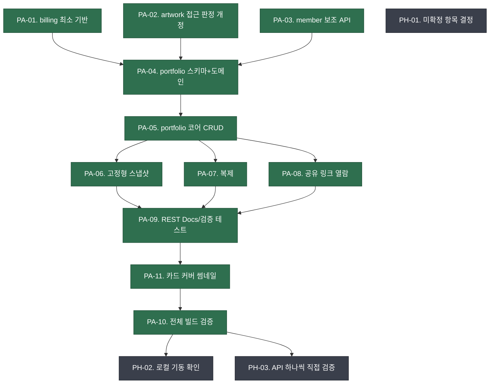

```mermaid
graph TD
    PA01["PA-01. billing 최소 기반"]
    PA02["PA-02. artwork 접근 판정 개정"]
    PA03["PA-03. member 보조 API"]
    PA04["PA-04. portfolio 스키마+도메인"]
    PA05["PA-05. portfolio 코어 CRUD"]
    PA06["PA-06. 고정형 스냅샷"]
    PA07["PA-07. 복제"]
    PA08["PA-08. 공유 링크 열람"]
    PA09["PA-09. REST Docs/검증 테스트"]
    PA11["PA-11. 카드 커버 썸네일"]
    PA10["PA-10. 전체 빌드 검증"]
    PH01["PH-01. 미확정 항목 결정"]
    PH02["PH-02. 로컬 기동 확인"]
    PH03["PH-03. API 하나씩 직접 검증"]

    PA01 --> PA04
    PA02 --> PA04
    PA03 --> PA04
    PA04 --> PA05
    PA05 --> PA06
    PA05 --> PA07
    PA05 --> PA08
    PA06 --> PA09
    PA07 --> PA09
    PA08 --> PA09
    PA09 --> PA11
    PA11 --> PA10
    PA10 --> PH02
    PA10 --> PH03

    classDef done fill:#2f6f4f,color:#fff,stroke:#1f4d36
    classDef inprogress fill:#8a6d1e,color:#fff,stroke:#5c4a14
    classDef pending fill:#3a3f4b,color:#fff,stroke:#20232b
    class PA01,PA02,PA03,PA04,PA05,PA06,PA07,PA08,PA09,PA11,PA10 done
    class PH02,PH03 pending
    class PH01 pending
```
