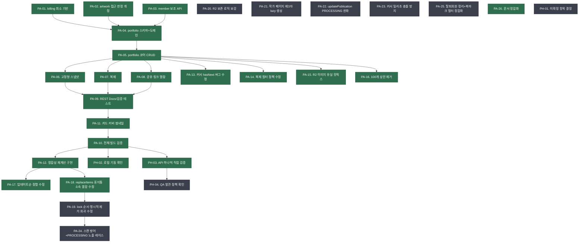

```mermaid
graph TD
    PA01["PA-01. billing 최소 기반"]
    PA02["PA-02. artwork 접근 판정 개정"]
    PA03["PA-03. member 보조 API"]
    PA04["PA-04. portfolio 스키마+도메인"]
    PA05["PA-05. portfolio 코어 CRUD"]
    PA06["PA-06. 고정형 스냅샷"]
    PA07["PA-07. 복제"]
    PA08["PA-08. 공유 링크 열람"]
    PA09["PA-09. REST Docs/검증 테스트"]
    PA11["PA-11. 카드 커버 썸네일"]
    PA10["PA-10. 전체 빌드 검증"]
    PA12["PA-12. 정합성 재계산 구현"]
    PA13["PA-13. 커서 hasNext 버그 수정"]
    PA14["PA-14. 복제 필터 정책 수정"]
    PA15["PA-15. R2 이미지 유실 핫픽스"]
    PA16["PA-16. 100개 상한 제거"]
    PA17["PA-17. 업데이트순 정렬 수정"]
    PA18["PA-18. replaceItems 휴지통 소속 결함 수정"]
    PA19["PA-19. lock 순서·명시적 제거 회귀 수정"]
    PA20["PA-20. R2 보존 로직 보강"]
    PA21["PA-21. 작가 페이지 제3자 lazy 생성"]
    PA22["PA-22. updatePublication PROCESSING 완화"]
    PA23["PA-23. 커서 밀리초 충돌 방지"]
    PA24["PA-24. 스캔 방어+PROCESSING 노출 레이스"]
    PA25["PA-25. 탈퇴회원 정리+북마크 필터 정합화"]
    PA26["PA-26. 문서 정합화"]
    PH01["PH-01. 미확정 항목 결정"]
    PH02["PH-02. 로컬 기동 확인"]
    PH03["PH-03. API 하나씩 직접 검증"]
    PH04["PH-04. QA 발견 정책 확인"]

    PA01 --> PA04
    PA02 --> PA04
    PA03 --> PA04
    PA04 --> PA05
    PA05 --> PA06
    PA05 --> PA07
    PA05 --> PA08
    PA06 --> PA09
    PA07 --> PA09
    PA08 --> PA09
    PA09 --> PA11
    PA11 --> PA10
    PA10 --> PH02
    PA10 --> PH03
    PA10 --> PA12
    PA05 --> PA13
    PA05 --> PA14
    PH03 --> PH04
    PA12 --> PA17
    PA05 --> PA15
    PA05 --> PA16
    PA12 --> PA18
    PA18 --> PA19
    PA19 --> PA24

    classDef done fill:#2f6f4f,color:#fff,stroke:#1f4d36
    classDef inprogress fill:#8a6d1e,color:#fff,stroke:#5c4a14
    classDef pending fill:#3a3f4b,color:#fff,stroke:#20232b
    class PA01,PA02,PA03,PA04,PA05,PA06,PA07,PA08,PA09,PA11,PA10,PH02,PH03 done
    class PA12,PA13,PA14,PA15,PA16,PA17,PA18,PA26 done
    class PA19,PA20,PA21,PA22,PA23,PA24,PA25,PH04 pending
    class PH01 pending
```
