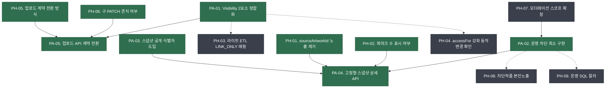

```mermaid
graph TD
    PA01["PA-01. Visibility 2요소 정합화"]
    PA02["PA-02. 운영 차단 최소 구현"]
    PA03["PA-03. 스냅샷 공개 식별자 도입"]
    PA04["PA-04. 고정형 스냅샷 상세 API"]
    PA05["PA-05. 업로드 API 계약 전환"]
    PH01["PH-01. sourceArtworkId 노출 제거"]
    PH02["PH-02. 북마크 수 표시 여부"]
    PH03["PH-03. 라이트 ETL LINK_ONLY 매핑"]
    PH04["PH-04. accessFor 강화 동작변경 확인"]
    PH05["PH-05. 업로드 계약 전환 방식"]
    PH06["PH-06. 구 PATCH 존치 여부"]
    PH07["PH-07. 모더레이션 스코프 확정"]
    PH08["PH-08. 차단작품 본인노출"]
    PH09["PH-09. 운영 SQL 절차"]

    PA03 --> PA04
    PA02 --> PA04
    PA01 --> PA05
    PH01 --> PA04
    PH02 --> PA04
    PH05 --> PA05
    PH06 --> PA05
    PH07 --> PA02
    PA01 -.-> PH03
    PA01 -.-> PH04
    PA02 -.-> PH08
    PA02 -.-> PH09

    classDef done fill:#2f6f4f,color:#fff,stroke:#1f4d36
    classDef inprogress fill:#8a6d1e,color:#fff,stroke:#5c4a14
    classDef pending fill:#3a3f4b,color:#fff,stroke:#20232b
    class PA01,PA02,PA03,PA04,PA05,PH01,PH02,PH05,PH06 done
    class PH03,PH04,PH07,PH08,PH09 pending
```
