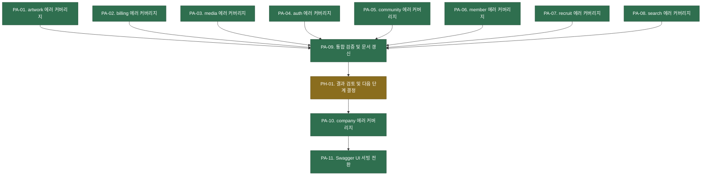

```mermaid
graph TD
    PA01["PA-01. artwork 에러 커버리지"]
    PA02["PA-02. billing 에러 커버리지"]
    PA03["PA-03. media 에러 커버리지"]
    PA04["PA-04. auth 에러 커버리지"]
    PA05["PA-05. community 에러 커버리지"]
    PA06["PA-06. member 에러 커버리지"]
    PA07["PA-07. recruit 에러 커버리지"]
    PA08["PA-08. search 에러 커버리지"]
    PA09["PA-09. 통합 검증 및 문서 갱신"]
    PA10["PA-10. company 에러 커버리지"]
    PA11["PA-11. Swagger UI 서빙 전환"]
    PH01["PH-01. 결과 검토 및 다음 단계 결정"]

    PA01 --> PA09
    PA02 --> PA09
    PA03 --> PA09
    PA04 --> PA09
    PA05 --> PA09
    PA06 --> PA09
    PA07 --> PA09
    PA08 --> PA09
    PA09 --> PH01
    PH01 --> PA10
    PA10 --> PA11

    classDef done fill:#2f6f4f,color:#fff,stroke:#1f4d36
    classDef inprogress fill:#8a6d1e,color:#fff,stroke:#5c4a14
    classDef pending fill:#3a3f4b,color:#fff,stroke:#20232b
    class PA01,PA02,PA03,PA04,PA05,PA06,PA07,PA08,PA09,PA10,PA11 done
    class PH01 inprogress
```
