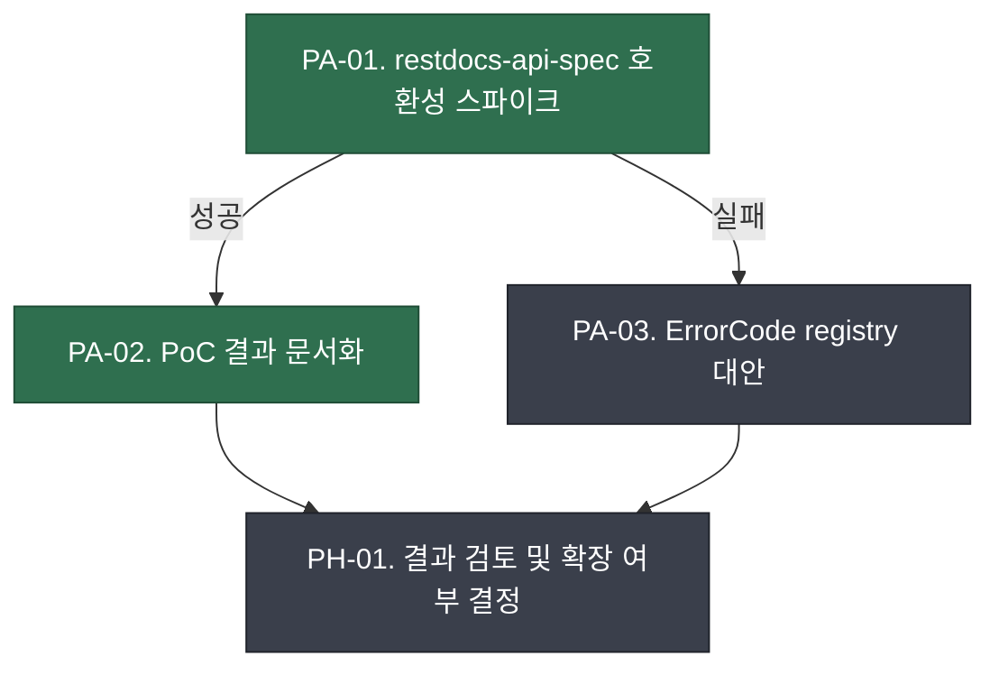

```mermaid
graph TD
    PA01["PA-01. restdocs-api-spec 호환성 스파이크"]
    PA02["PA-02. PoC 결과 문서화"]
    PA03["PA-03. ErrorCode registry 대안"]
    PH01["PH-01. 결과 검토 및 확장 여부 결정"]

    PA01 -->|성공| PA02
    PA01 -->|실패| PA03
    PA02 --> PH01
    PA03 --> PH01

    classDef done fill:#2f6f4f,color:#fff,stroke:#1f4d36
    classDef inprogress fill:#8a6d1e,color:#fff,stroke:#5c4a14
    classDef pending fill:#3a3f4b,color:#fff,stroke:#20232b
    class PA01,PA02 done
    class PA03 pending
    class PH01 pending
```
