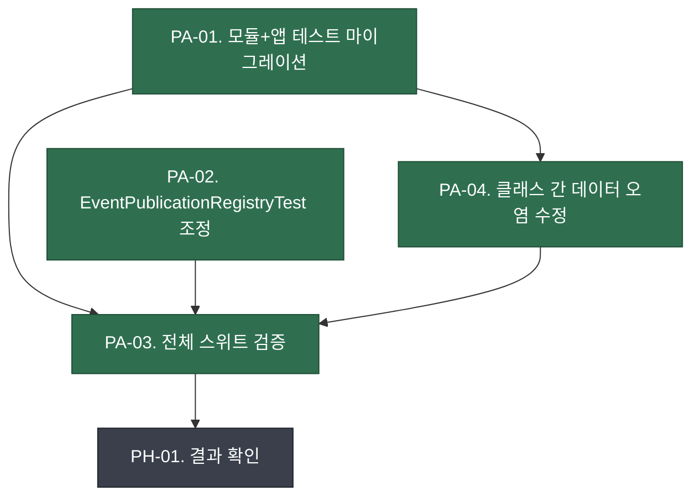

```mermaid
graph TD
    PA01["PA-01. 모듈+앱 테스트 마이그레이션"]
    PA02["PA-02. EventPublicationRegistryTest 조정"]
    PA04["PA-04. 클래스 간 데이터 오염 수정"]
    PA03["PA-03. 전체 스위트 검증"]
    PH01["PH-01. 결과 확인"]

    PA01 --> PA04
    PA01 --> PA03
    PA02 --> PA03
    PA04 --> PA03
    PA03 --> PH01

    classDef done fill:#2f6f4f,color:#fff,stroke:#1f4d36
    classDef inprogress fill:#8a6d1e,color:#fff,stroke:#5c4a14
    classDef pending fill:#3a3f4b,color:#fff,stroke:#20232b
    class PA01,PA02,PA03,PA04 done
    class PH01 pending
```
