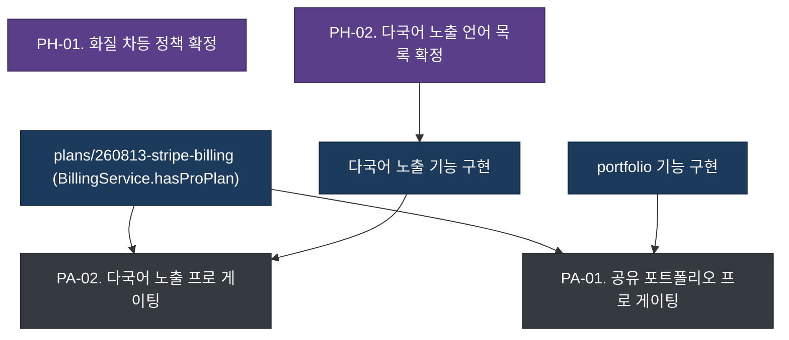

# 프로 플랜 게이팅 잔여분 (포트폴리오·다국어)

```mermaid
graph TD
    BILLING["plans/260813-stripe-billing (BillingService.hasProPlan)"]
    PORT["portfolio 기능 구현"]
    I18N["다국어 노출 기능 구현"]

    PH01["PH-01. 화질 차등 정책 확정"]
    PH02["PH-02. 다국어 노출 언어 목록 확정"]
    PA01["PA-01. 공유 포트폴리오 프로 게이팅"]
    PA02["PA-02. 다국어 노출 프로 게이팅"]

    BILLING --> PA01
    BILLING --> PA02
    PORT --> PA01
    I18N --> PA02
    PH02 --> I18N

    classDef todo fill:#343a40,stroke:#212529,color:#fff
    classDef human fill:#5a3e8a,stroke:#3c2a5c,color:#fff
    classDef ext fill:#1b3a5c,stroke:#12283f,color:#fff

    class PA01,PA02 todo
    class PH01,PH02 human
    class BILLING,PORT,I18N ext
```
