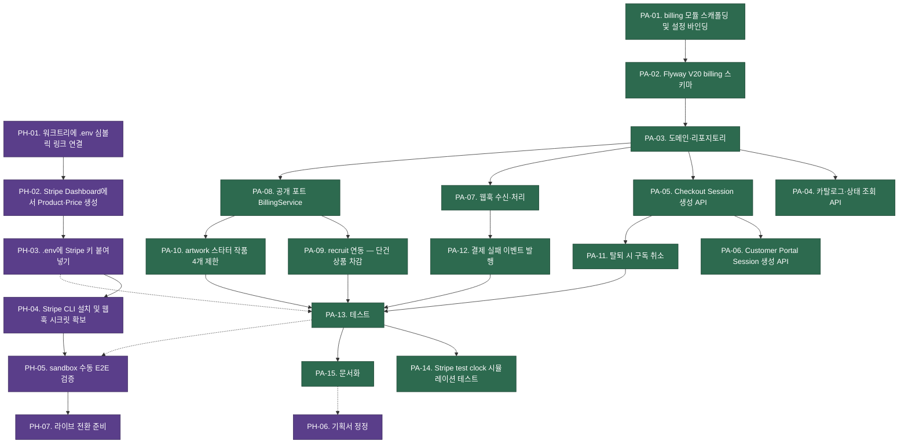

# Stripe 결제/구독 모듈

```mermaid
graph TD
    PH01["PH-01. 워크트리에 .env 심볼릭 링크 연결"]
    PH02["PH-02. Stripe Dashboard에서 Product·Price 생성"]
    PH03["PH-03. .env에 Stripe 키 붙여넣기"]
    PH04["PH-04. Stripe CLI 설치 및 웹훅 시크릿 확보"]
    PH05["PH-05. sandbox 수동 E2E 검증"]
    PH06["PH-06. 기획서 정정"]
    PH07["PH-07. 라이브 전환 준비"]

    PA01["PA-01. billing 모듈 스캐폴딩 및 설정 바인딩"]
    PA02["PA-02. Flyway V20 billing 스키마"]
    PA03["PA-03. 도메인·리포지토리"]
    PA04["PA-04. 카탈로그·상태 조회 API"]
    PA05["PA-05. Checkout Session 생성 API"]
    PA06["PA-06. Customer Portal Session 생성 API"]
    PA07["PA-07. 웹훅 수신·처리"]
    PA08["PA-08. 공개 포트 BillingService"]
    PA09["PA-09. recruit 연동 — 단건 상품 차감"]
    PA10["PA-10. artwork 스타터 작품 4개 제한"]
    PA11["PA-11. 탈퇴 시 구독 취소"]
    PA12["PA-12. 결제 실패 이벤트 발행"]
    PA13["PA-13. 테스트"]
    PA14["PA-14. Stripe test clock 시뮬레이션 테스트"]
    PA15["PA-15. 문서화"]

    PH01 --> PH02 --> PH03 --> PH04 --> PH05
    PA01 --> PA02 --> PA03
    PA03 --> PA04
    PA03 --> PA05 --> PA06
    PA03 --> PA07
    PA03 --> PA08
    PA05 --> PA11
    PA07 --> PA12
    PA08 --> PA09
    PA08 --> PA10
    PA09 --> PA13
    PA10 --> PA13
    PA11 --> PA13
    PA12 --> PA13
    PA13 --> PA14
    PA13 --> PA15
    PH03 -.-> PA13
    PA13 -.-> PH05
    PA15 -.-> PH06
    PH05 --> PH07

    classDef done fill:#2d6a4f,stroke:#1b4332,color:#fff
    classDef todo fill:#343a40,stroke:#212529,color:#fff
    classDef human fill:#5a3e8a,stroke:#3c2a5c,color:#fff

    class PA01,PA02,PA03,PA04,PA05,PA06,PA07,PA08,PA09,PA10,PA11,PA12,PA13,PA14,PA15 done
    class PH01,PH02,PH03,PH04,PH05,PH06,PH07 human
```
